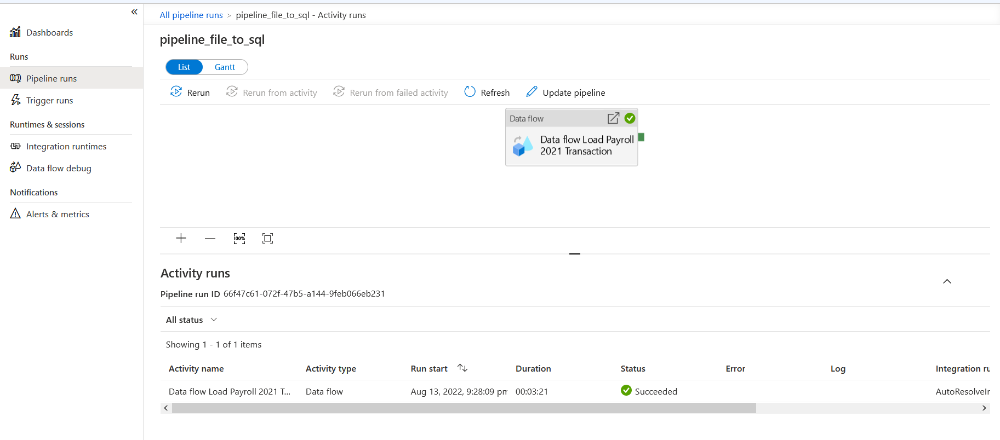
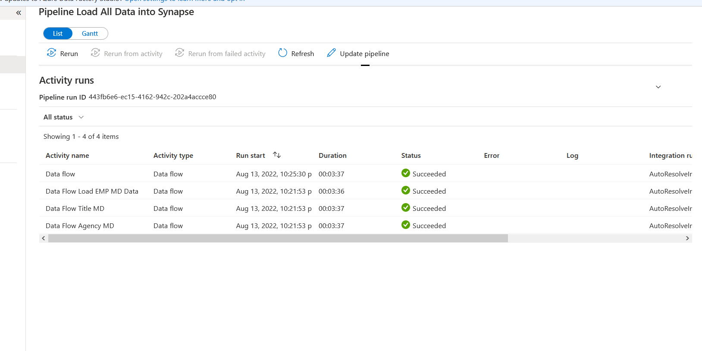
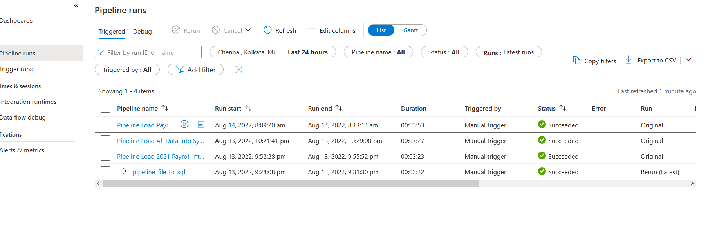
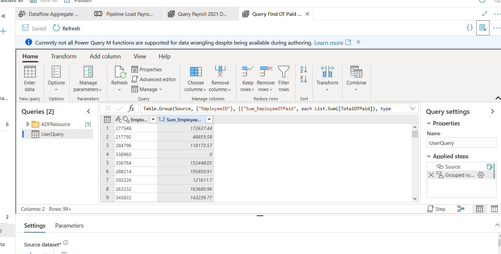

# Project 05 : Azure Data Integration Pipelines for NYC Payroll Data

This project creates and implements high-quality parameterized data pipelines for the City of New York's financial resources.
It analyzes employee payroll data and summarizes it by Department and Financial Year. The data included is for the Financial Years 2020 and 2021.  
The source data resides on Azure Data Lake Gen 2 and is loaded into a Synapse Data Warehouse for processing. The source datasets consist of CSV files with Employee master data and monthly payroll data entered by various City agencies. 

## Ingestion Steps
The data lake consists of 3 folders, 1 for employee payroll data and the master data files, 1 for historical employee data from the year 2020,  
and 1 for staging data when the data is loaded into Synapse.  

A single pipeline is used to load payroll data from the data lake into Azure SQL DB.
Another pipeline loads Agency, Title, And Employee master from the data lake into Synapse.
A final pipeline joins Current Fiscal Year PAyroll Data with Historical (2020) data, aggregates it by Year and Department and loads it into a summary table in Synapse.

### Payroll to SQL DB Pipeline  

### Master Data to Synapse Pipeline  

### Aggregated Data to Synapse Pipeline

## Power Queries
Two power queries have been created, 1 from the aggregated data and 1 from the employee payroll table in synapse.  
The employee payroll query has been grouped by employee ID to find the Overtime pay of each employee in the company, since
the NYC Payroll team would like to know how much overtime pay is part of their budget.  

